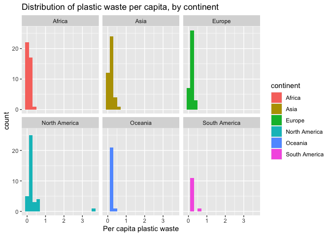
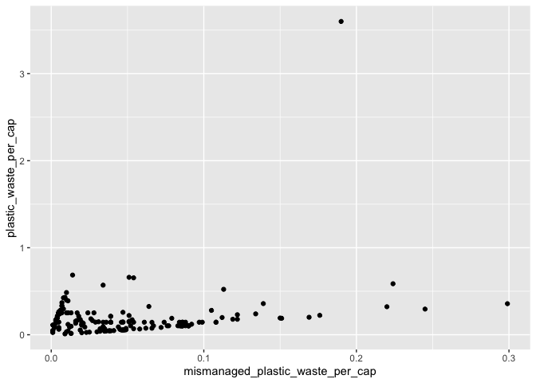

Lab 02 - Plastic waste
================
John T. Bennett
Feb. 9, 2022

## Load packages and data

``` r
library(tidyverse) 
```

``` r
plastic_waste <- read.csv("data/plastic-waste.csv")
View(plastic_waste)
help()
```

Warm up:

1.  R Studio panes: On right side, Source is on top of Console. On left
    side, Environment is on top of Files/Plots

2.  There are 240 observations

3.  NA - missing data?

## Exercises

Trinidad and Tobago stands out, which makes sense based on their lax
waste management practices.

``` r
ggplot(data = plastic_waste, aes(x = plastic_waste_per_cap)) +
  geom_histogram(binwidth = 0.2)
```

    ## Warning: Removed 51 rows containing non-finite values (stat_bin).

<!-- -->

``` r
plastic_waste %>%
  filter(plastic_waste_per_cap > 3.5)
```

    ##   code              entity     continent year gdp_per_cap plastic_waste_per_cap
    ## 1  TTO Trinidad and Tobago North America 2010    31260.91                   3.6
    ##   mismanaged_plastic_waste_per_cap mismanaged_plastic_waste coastal_pop
    ## 1                             0.19                    94066     1358433
    ##   total_pop
    ## 1   1341465

### Exercise 1.1. Plot, using histograms, the distribution of plastic waste per capita faceted by continent.

``` r
ggplot(data = plastic_waste, aes(x = plastic_waste_per_cap, fill = continent)) +
  geom_histogram(binwidth = 0.2) +
 labs(
   x = "Per capita plastic waste",
   title = "Distribution of plastic waste per capita, by continent"
 ) +
 facet_wrap(~ continent, nrow = 2)
```

    ## Warning: Removed 51 rows containing non-finite values (stat_bin).

<!-- -->

1.1.a. Visualizing numerical data using density plots.

``` r
ggplot(data = plastic_waste, aes(x = plastic_waste_per_cap)) +
  geom_density()
```

    ## Warning: Removed 51 rows containing non-finite values (stat_density).

<!-- -->

1.1.b. Comparing distributions across continents by coloring density
curves by continent.

``` r
ggplot(data = plastic_waste, 
       mapping = aes(x = plastic_waste_per_cap, 
                     color = continent)) +
  geom_density()
```

    ## Warning: Removed 51 rows containing non-finite values (stat_density).

<!-- -->

1.1.c. Filling curves with colors

``` r
ggplot(data = plastic_waste, 
       mapping = aes(x = plastic_waste_per_cap, 
                     color = continent, 
                     fill = continent)) +
  geom_density()
```

    ## Warning: Removed 51 rows containing non-finite values (stat_density).

<!-- -->

### Exercise 2.1. Recreating density plots using lower alpha level

``` r
ggplot(data = plastic_waste, 
       mapping = aes(x = plastic_waste_per_cap, 
                     color = continent, 
                     fill = continent)) +
  geom_density()
```

    ## Warning: Removed 51 rows containing non-finite values (stat_density).

<!-- -->

### Exercise 2.1. Recreating density plots using lower alpha level

Jabber jabber

``` r
ggplot(data = plastic_waste, 
       mapping = aes(x = plastic_waste_per_cap, 
                     color = continent, 
                     fill = continent)) +
  geom_density(alpha = 0.1)
```

    ## Warning: Removed 51 rows containing non-finite values (stat_density).

<!-- -->

### Exercise 2.2

I think we defined the alpha level as a characteristic of the plotting
geom because this definition refers specifically to the density or
transparency of what we mapped- meaning the curves.

### Exercise 3.1. Convert side-by-side box plots to violin plots.

Box plots:

``` r
ggplot(data = plastic_waste, 
       mapping = aes(x = continent, 
                     y = plastic_waste_per_cap)) +
  geom_boxplot()
```

    ## Warning: Removed 51 rows containing non-finite values (stat_boxplot).

<!-- -->

Violin plots:

``` r
ggplot(plastic_waste, aes(x = continent, y = plastic_waste_per_cap)) +
  geom_violin()
```

    ## Warning: Removed 51 rows containing non-finite values (stat_ydensity).

<!-- -->

3.1.a. What do the violin plots reveal that box plots do not?

Instead of using bars, the violin plots show us the shape of the data
distribution.

3.1.b. What features are apparent in the box plots but not in the violin
plots?

The boxes show us a tidy visualization of where 50% of the data lay in
the distribution.

### Exercise 4.1. Scatterplot- relationship between plastic waste per capita and mismanaged plastic waste per capita

``` r
ggplot(plastic_waste, aes(x = mismanaged_plastic_waste_per_cap, y = plastic_waste_per_cap)) +
  geom_point()
```

    ## Warning: Removed 51 rows containing missing values (geom_point).

<!-- -->

Describe the relationship: Something other than plastic waste per capita
must be driving mismanaged plastic waste per capita. The lowest levels
of mismanaged waste and the highest levels of mismanaged waste occur
within the same narrow range of plastic waste per capita. Thus,
mismanaged plastic waste per capita is weakly related to plastic waste
per capita.

### Exercise 4.2. Color the points in the scatterplot by continent.

``` r
ggplot(plastic_waste, aes(x = mismanaged_plastic_waste_per_cap, y = plastic_waste_per_cap, color = continent)) +
  geom_point()
```

    ## Warning: Removed 51 rows containing missing values (geom_point).

<!-- -->

4.2.a. Does there seem to be any clear distinctions between continents
with respect to how plastic waste per capita and mismanaged plastic
waste per capita are associated? The noteworthy pattern, in my opinion,
is that Europe has very low levels of both plastic waste per capita and
mismanaged plastic waste per capita.

### Exercise 4.3. Visualize the relationship between plastic waste per capita and total population as well as plastic waste per capita and coastal population.

4.3.a. Relationship between plastic waste per capita and total
population

``` r
ggplot(plastic_waste, aes(x = total_pop, y = plastic_waste_per_cap)) +
  geom_point()
```

    ## Warning: Removed 61 rows containing missing values (geom_point).

<!-- -->

4.3.b. Relationship between plastic waste per capita and coastal
population

``` r
ggplot(plastic_waste, aes(x = coastal_pop, y = plastic_waste_per_cap)) +
  geom_point()
```

    ## Warning: Removed 51 rows containing missing values (geom_point).

<!-- -->

4.3.c. Do either of these pairs of variables appear to be more strongly
linearly associated?

Population appears to have a stronger relationship with plastic waste
per capita than coastal population has with plastic waste per capita.
However, appearances could be decieving. The coastal population is
smaller than the total population, so the data appear more densely
bunched together in the coastal population plot. In contrast, total
population is spread out across a higher value on the x-axis than
coastal population, making the relationships appear more diffuse. We
need to compare the two plots more directly by comparing the two plots
when the x axis is of equal length. (Or plotting both pairs of variables
together at the same time)

### Exercise 5.1.

I gave this one a shot, but nothing doing this time…

``` r
ggplot(plastic_waste, aes(x = coastal_pop, y = plastic_waste_per_cap, color = continent)) + geom_point(aes(color = continent))  + geom_point(alpha = (1/3), size = 3) + geom_smooth(lwd = 3, se = FALSE)  + geom_point(alpha = (1/3), size = 3) + facet_wrap(~ continent) +
  geom_smooth(lwd = 1.5, se = FALSE)
```

    ## `geom_smooth()` using method = 'loess' and formula 'y ~ x'

    ## Warning: Removed 51 rows containing non-finite values (stat_smooth).

    ## `geom_smooth()` using method = 'loess' and formula 'y ~ x'

    ## Warning: Removed 51 rows containing non-finite values (stat_smooth).

    ## Warning: Removed 51 rows containing missing values (geom_point).
    ## Removed 51 rows containing missing values (geom_point).
    ## Removed 51 rows containing missing values (geom_point).

<!-- -->

### Pro-Tips

Radioactive manta rays!

``` r
ggplot(data = plastic_waste, 
       mapping = aes(x = continent, 
                     y = plastic_waste_per_cap)) +
  geom_violin()+
  geom_boxplot(width=.3, fill="green") +
  stat_summary(fun.y=median, geom="point") 
```

    ## Warning: `fun.y` is deprecated. Use `fun` instead.

    ## Warning: Removed 51 rows containing non-finite values (stat_ydensity).

    ## Warning: Removed 51 rows containing non-finite values (stat_boxplot).

    ## Warning: Removed 51 rows containing non-finite values (stat_summary).

<!-- -->

Helpful
reference:<http://www.sthda.com/english/wiki/ggplot2-themes-and-background-colors-the-3-elements>
